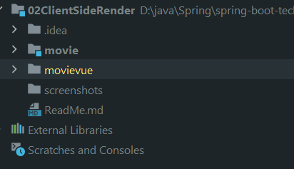
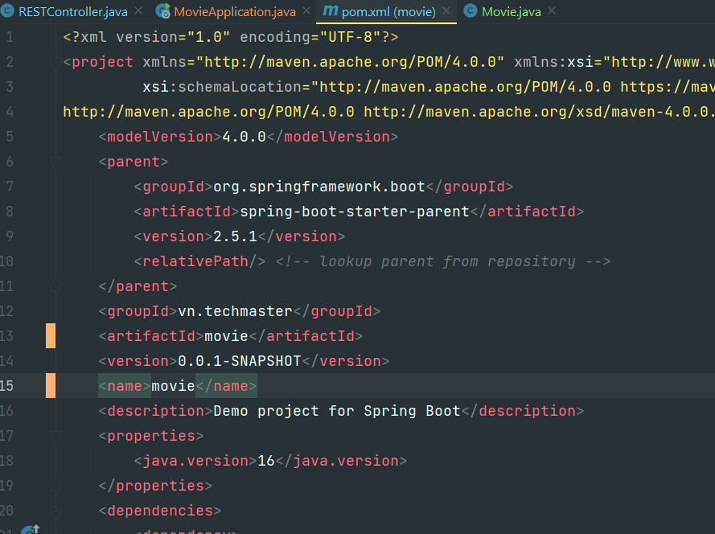
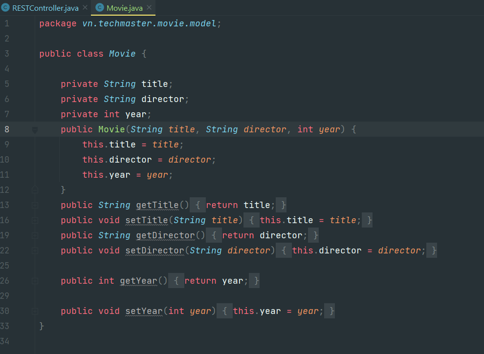
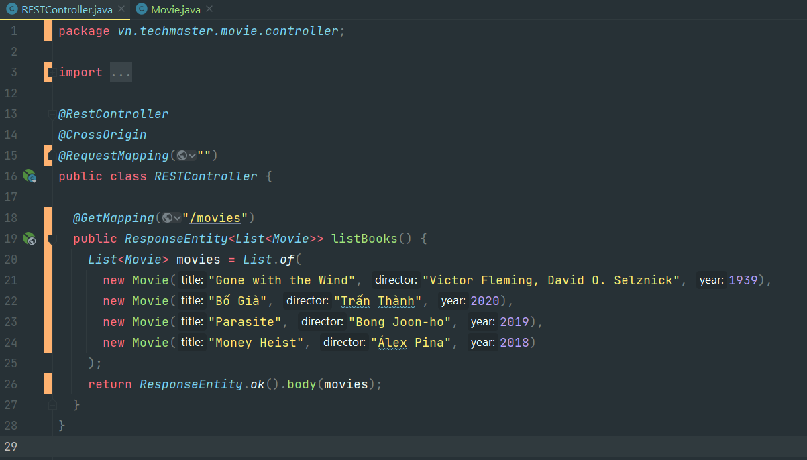
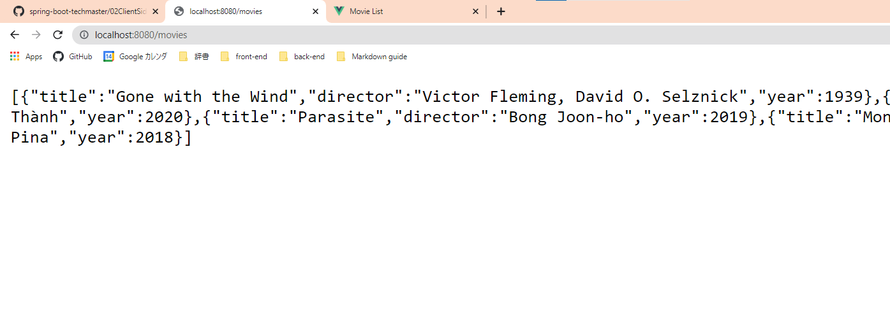
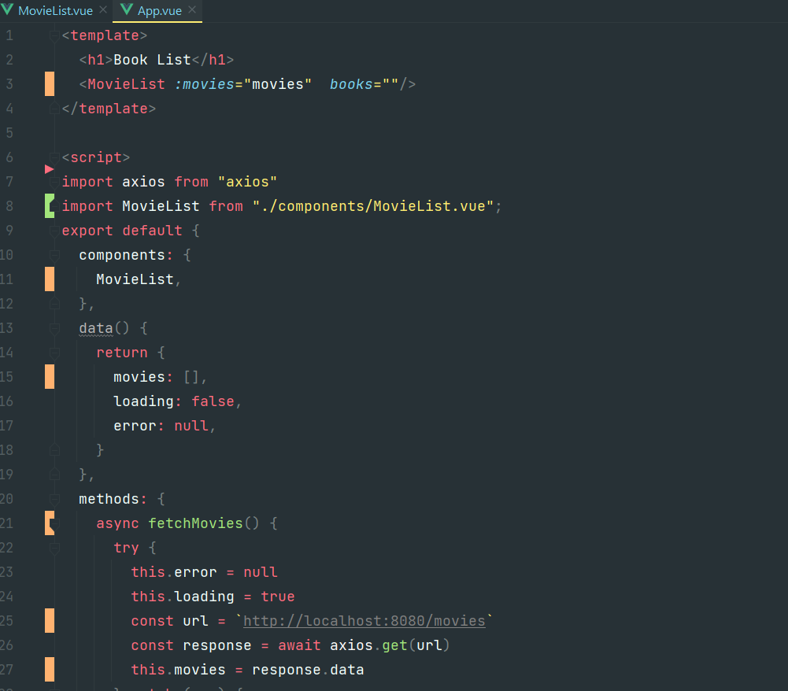
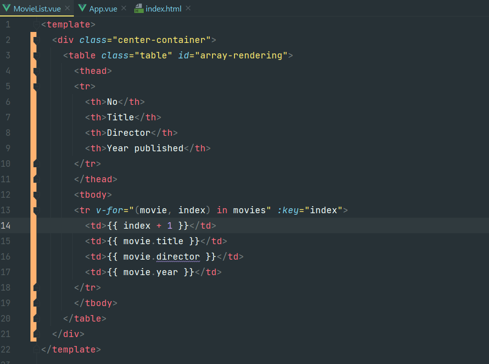
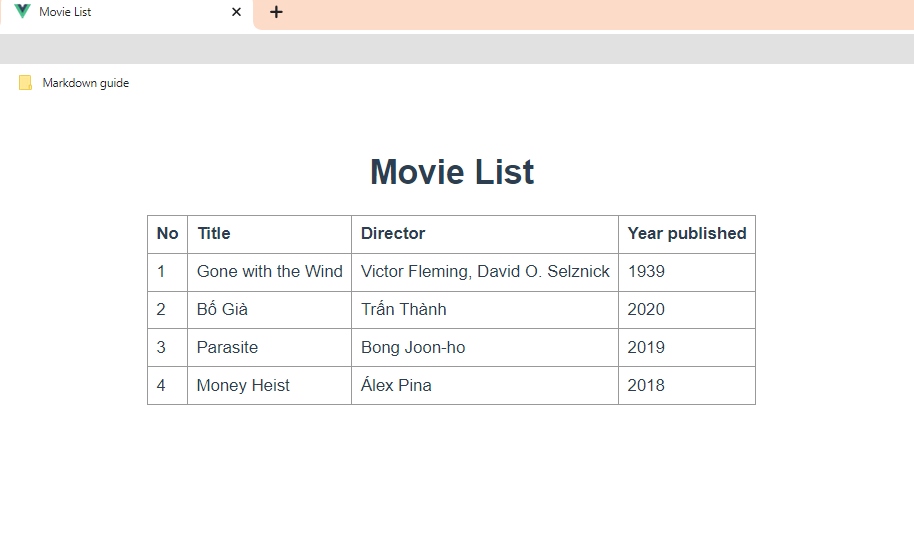

## MovieList Client-Side Render

#### Bước 1: Copy Book project và Refactoring thành movie & movievue:

#### Bước 2: Sửa lại pom files -> movie
  

#### Bước 3: Create Movie Class (replace book class)
  

#### Bước 4: RequestMapping & run test

#### Bước 5: Sửa lại các phần books -> movies ở App.vue & sửa url

#### Bước 6: Render ở MovieList.vue & thêm cột index

#### Bước 7: Run

