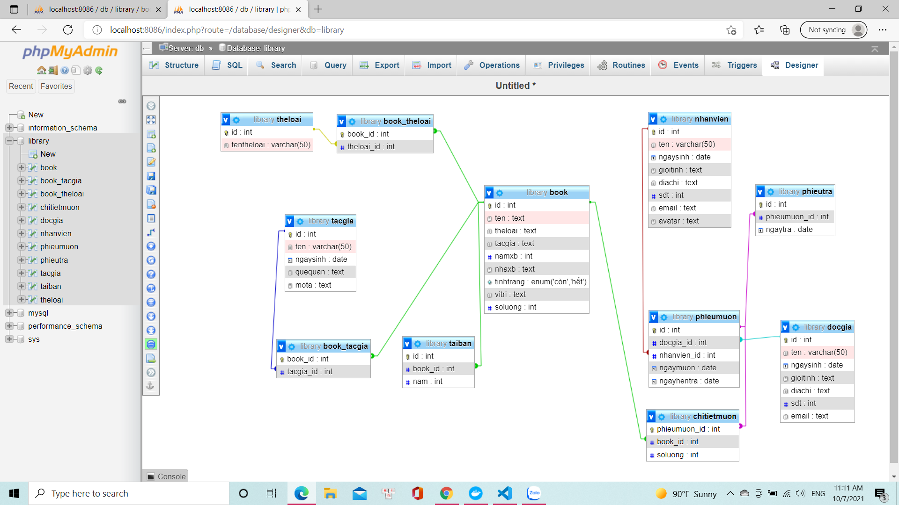
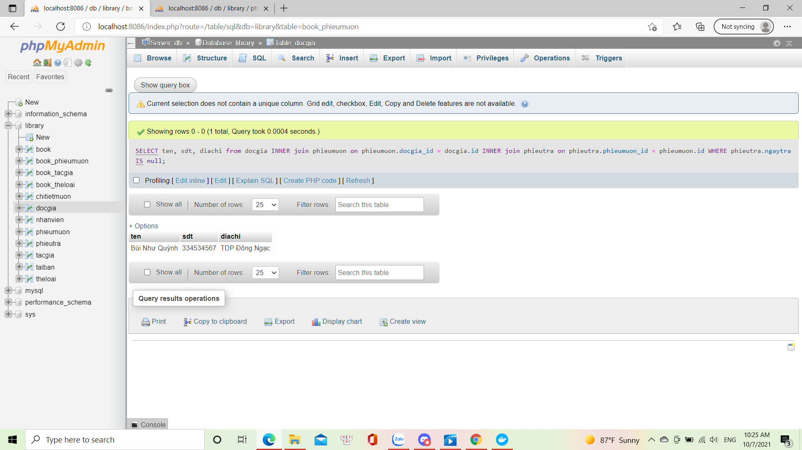
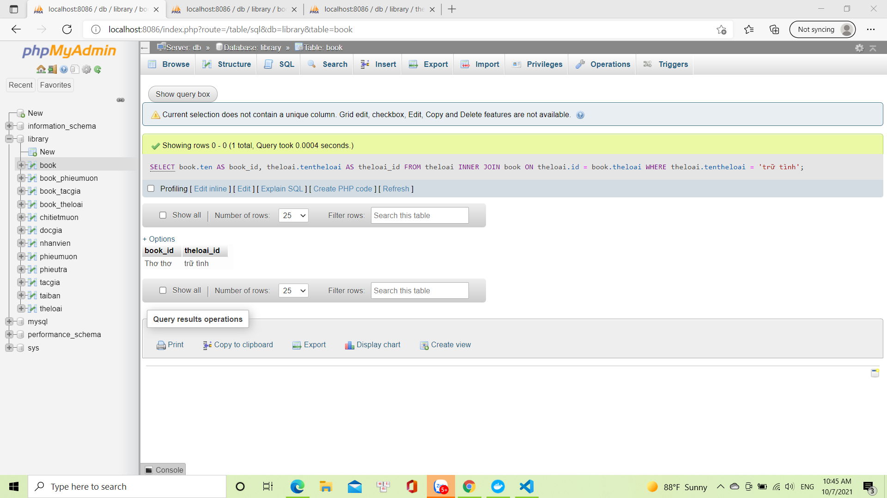
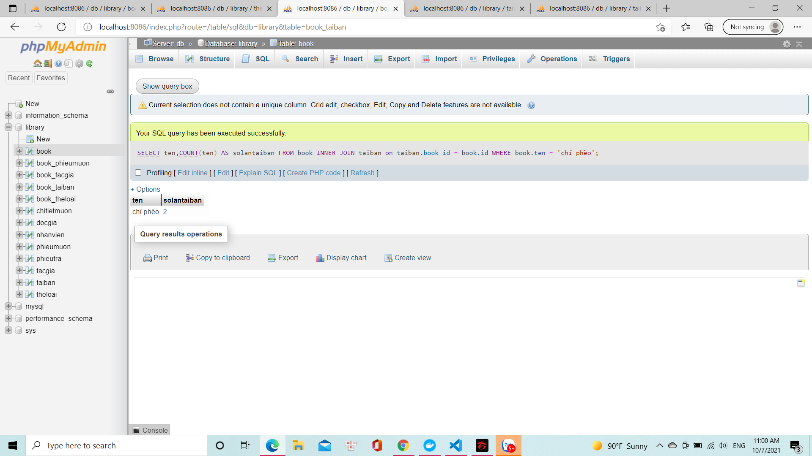

# câu 1:
SELECT ten, sdt, diachi 
from docgia 
INNER join phieumuon on phieumuon.docgia_id = docgia.id 
INNER join phieutra on phieutra.phieumuon_id = phieumuon.id 
WHERE phieutra.ngaytra IS null

# câu 2:
SELECT book.ten AS book_id, theloai.tentheloai AS theloai_id FROM theloai 
INNER JOIN book ON theloai.id = book.theloai 
WHERE theloai.tentheloai = 'trữ tình'

# câu 3:
SELECT ten,COUNT(ten) AS solantaiban 
FROM book 
INNER JOIN taiban on taiban.book_id = book.id 
WHERE book.ten = 'chí phèo'
