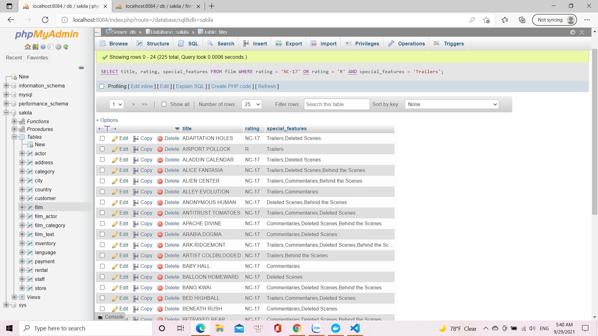
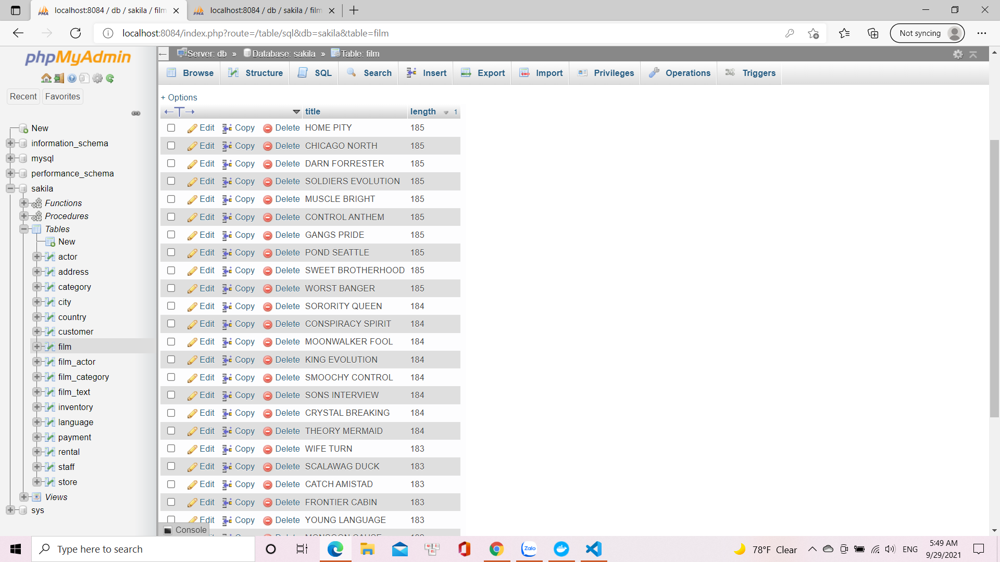
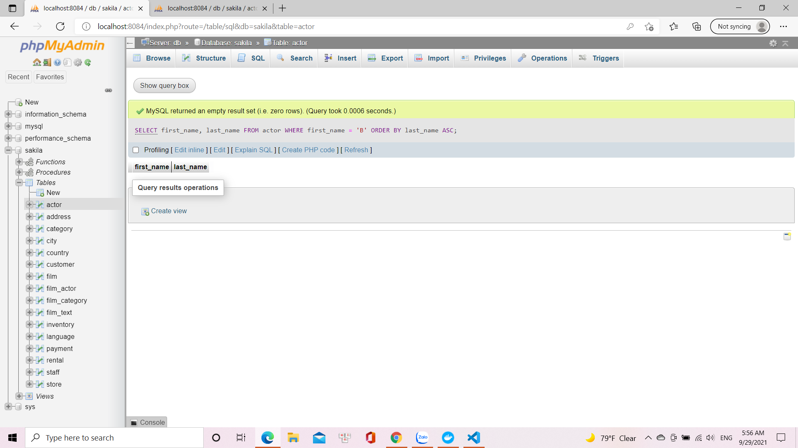
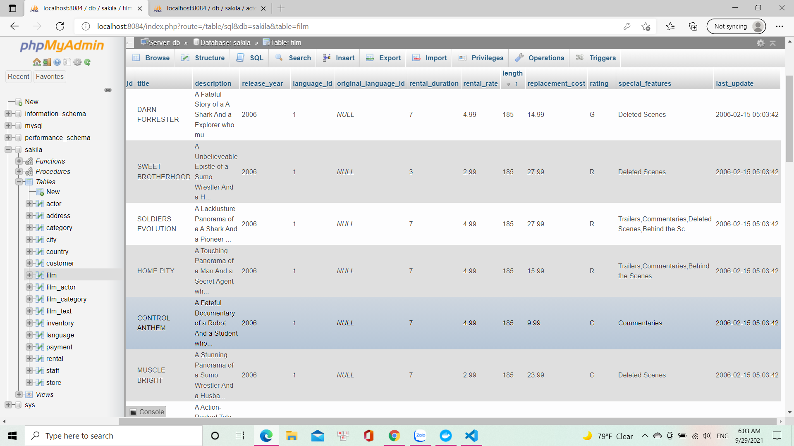

# Lấy tên phim, rating, special_features các bộ phim có rating là NC-17 hoặc R, có special_features là Trailers:

SELECT title, rating, special_features 
FROM film
WHERE rating = 'NC-17' OR rating = 'R' AND special_features = 'Trailers'

# Lấy ra tên phim, length các bộ phim có length nhỏ hơn 70 hoặc length lớn hơn 100. Sắp xếp phim theo thứ tự length tăng dần:
SELECT title, length 
FROM film
WHERE length<70 OR length>100
ORDER BY length DESC

# Lấy ra các actor có first_name bắt đầu là chữ B và sắp xếp theo thứ tự last_name tăng dần:
SELECT first_name, last_name 
FROM actor
WHERE first_name = 'B' 
ORDER BY last_name ASC

# Lấy ra các bộ phim không có chứa từ 'LIFE', không phải rating PG và sắp xếp theo thứ tự length giảm dần:
SELECT * 
FROM film
WHERE title NOT LIKE '%LIFE%' AND rating NOT LIKE '%PG%'
ORDER BY length DESC

