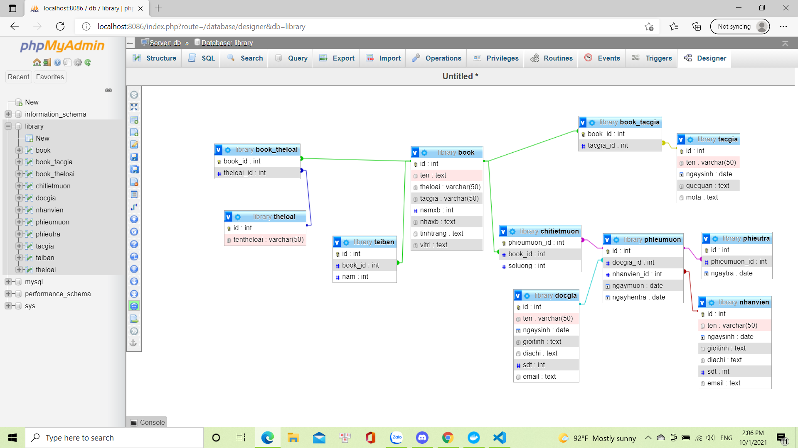

# create book:
CREATE TABLE book(
	id int AUTO_INCREMENT PRIMARY KEY,
    ten TEXT NOT NULL,
    theloai VARCHAR(50) NOT NULL,
    tacgia VARCHAR(50) NOT NULL,
    namxb int NOT NULL,
    nhaxb TEXT NOT NULL,
    tinhtrang TEXT NOT NULL,
    vitri TEXT NOT NULL
)

# create thể loại:
CREATE TABLE theloai(
	id int AUTO_INCREMENT PRIMARY KEY,
    tentheloai VARCHAR(50) NOT NULL
)

# create book_theloai:
CREATE TABLE book_theloai(
	book_id int PRIMARY KEY,
    theloai_id int,
    FOREIGN KEY(book_id) REFERENCES book(id),
    FOREIGN KEY(theloai_id) REFERENCES theloai(id)
)

# create tác giả:
CREATE TABLE tacgia(
	id int AUTO_INCREMENT PRIMARY KEY,
    ten VARCHAR(50) NOT NULL,
    ngaysinh DATE,
    quequan TEXT,
    mota TEXT
)
# create book_tacgia:
CREATE TABLE book_tacgia(
	book_id int PRIMARY KEY,
    tacgia_id int,
    FOREIGN KEY (book_id) REFERENCES book(id),
    FOREIGN KEY (tacgia_id) REFERENCES tacgia(id)
)
# create tái bản:
CREATE TABLE taiban(
	id int PRIMARY KEY,
    book_id int,
    nam int,
	FOREIGN KEY (book_id) REFERENCES book(id)
)
# create độc giả:
CREATE TABLE docgia(
    id int AUTO_INCREMENT PRIMARY KEY,
    ten VARCHAR(50) NOT NULL,
    ngaysinh DATE NOT NULL,
    gioitinh TEXT NOT NULL,
    diachi TEXT,
    sdt int NOT NULL,
    email TEXT NOT NULL
   )
# create nhân viên:
CREATE TABLE nhanvien(
    id int AUTO_INCREMENT PRIMARY KEY,
    ten VARCHAR(50) NOT NULL,
    ngaysinh DATE NOT NULL,
    gioitinh TEXT NOT NULL,
    diachi TEXT,
    sdt int NOT NULL,
    email TEXT NOT NULL
)

# create phiếu mượn:
CREATE TABLE phieumuon(
	id int AUTO_INCREMENT PRIMARY KEY,
    docgia_id int NOT NULL,
    nhanvien_id int NOT NULL,
    ngaymuon DATE NOT NULL,
    ngayhentra DATE NOT NULL,
    FOREIGN KEY (docgia_id) REFERENCES docgia(id),
    FOREIGN KEY (nhanvien_id) REFERENCES nhanvien(id)
)
# create chi tiết phiếu mượn:
CREATE TABLE chitietmuon(
	phieumuon_id int PRIMARY KEY,
    book_id int,
    soluong int NOT NULL,
    FOREIGN KEY (phieumuon_id) REFERENCES phieumuon(id),
    FOREIGN KEY (book_id) REFERENCES book(id)
)
# create phiếu trả:
CREATE TABLE phieutra(
    id int AUTO_INCREMENT PRIMARY KEY,
	phieumuon_id int,
    ngaytra DATE NOT NULL,
    FOREIGN KEY (phieumuon_id) REFERENCES phieumuon(id)
)
# data:
